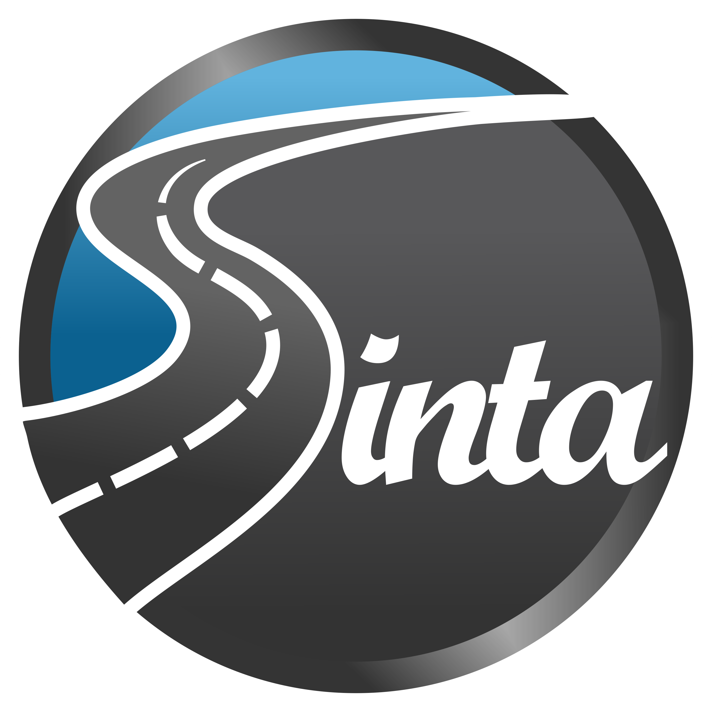
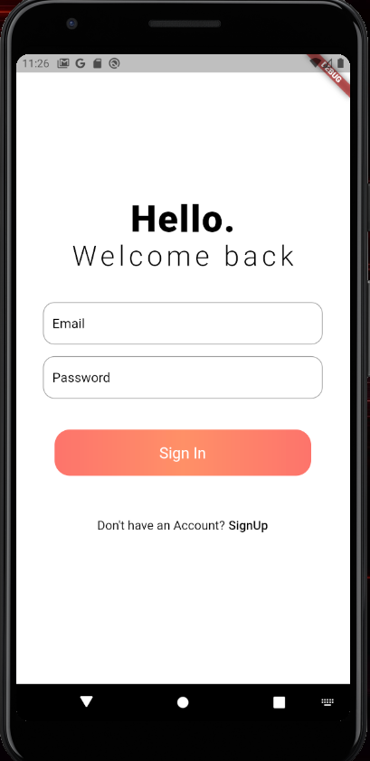
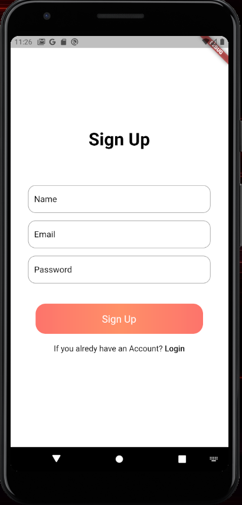
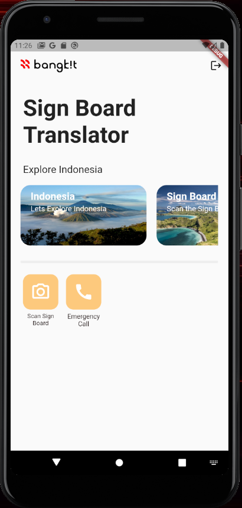
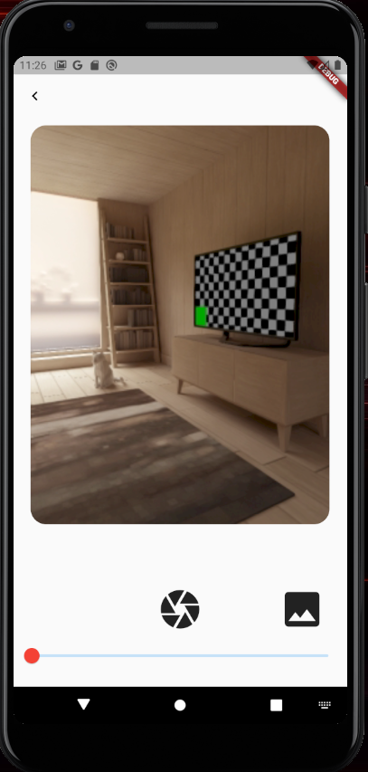
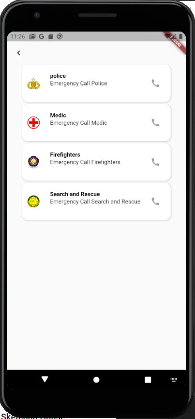

# Final-Project-SINTA

<!-- PROJECT LOGO -->
 

  

  <h3 align="center">SINTA - Sign Board Translator</h3>

  

    SignBoard Translator [ Bangkit Capstone Project ] 2021
     
    <a href="https://github.com/difaandika/Final-Project-SINTA"><strong>Explore the docs »</strong></a>
     
     
    <a href="https://youtu.be/yMtv7RY4Khg">View Demo</a>
    ·
    <a href="https://github.com/difaandika/Final-Project-SINTA">Report Bug</a>
    ·
    <a href="https://github.com/difaandika/Final-Project-SINTA">Request Feature</a>
  

<!-- TABLE OF CONTENTS -->

  
Table of Contents

  <ol>
    <li>
      <a href="#about-the-project">About The Project</a>
      <ul>
        <li><a href="#built-with">Built With</a></li>
      </ul>
    </li>
    <li>
      <a href="#getting-started">Getting Started</a>
      <ul>
        <li><a href="#prerequisites">Prerequisites</a></li>
        <li><a href="#installation">Installation</a></li>
      </ul>
    </li>
    <li><a href="#usage">Usage</a></li>
    <li><a href="#contributing">Contributing</a></li>   
    <li><a href="#contact">Contact</a></li>
    
  </ol>

<!-- ABOUT THE PROJECT -->
## About The Project

<table>
    <tr>
        <td><strong>     Login Page          </strong></td>
        <td><strong>  Signup Page     </strong></td>
      <td> <strong>      Home Page</strong> </td>
      <td> <strong>      Scan Sign Page</strong> </td>
      <td> <strong>      Emergency Call Page</strong> </td>
    </tr>
    <tr>
        <td>
          &nbsp;&nbsp;&nbsp;&nbsp;&nbsp;&nbsp;&nbsp;&nbsp;
          
          &nbsp;&nbsp;&nbsp;&nbsp;&nbsp;&nbsp;&nbsp;&nbsp;
        </td>
        <td>
          &nbsp;&nbsp;&nbsp;&nbsp;&nbsp;&nbsp;&nbsp;&nbsp;
          
          &nbsp;&nbsp;&nbsp;&nbsp;&nbsp;&nbsp;&nbsp;&nbsp;
      </td>
      <td>
        &nbsp;&nbsp;&nbsp;&nbsp;&nbsp;&nbsp;&nbsp;&nbsp;
        
        &nbsp;&nbsp;&nbsp;&nbsp;&nbsp;&nbsp;&nbsp;&nbsp;
      </td>
      <td>
        &nbsp;&nbsp;&nbsp;&nbsp;&nbsp;&nbsp;&nbsp;&nbsp;
        
        &nbsp;&nbsp;&nbsp;&nbsp;&nbsp;&nbsp;&nbsp;&nbsp;
      </td>
     <td>
          &nbsp;&nbsp;&nbsp;&nbsp;&nbsp;&nbsp;&nbsp;&nbsp;
          
          &nbsp;&nbsp;&nbsp;&nbsp;&nbsp;&nbsp;&nbsp;&nbsp;
        </td>
    </tr>
</table>

Traffic signs are important things for road users, but sign explanations and guidance are still lacking especially for foreign people or tourists. Many foreign tourists do not understand and get confused about the sign, resulting in breaking the rules or getting into some accidents. Using machine learning and signboard datasets that exists in Indonesia, we are trying to improve the tourism accessibility and making tourists understand and appreciate more about the sign throughout the street. We are trying to combine image classification in machine learning, cloud computing and mobile development to make an apps that can translate the photo of sign board that taken before. We hope from this idea, it can help many tourists from foreign countries to have a comfortable living in Indonesia.

### Built With

* [Flutter](https://flutter.dev/)
* [Tensorflow](https://www.tensorflow.org/)
* [Firebase](https://firebase.google.com/)
* [Vscode](https://code.visualstudio.com/)
* [Google Cloud Platform](https://cloud.google.com/)

<!-- GETTING STARTED -->
## Getting Started

To get a local copy up and running follow these simple example steps.

### Prerequisites

1. Internet Connection
2. Android 

### Installation

1. Download the APK here [Here](https://drive.google.com/drive/folders/1tgjpaiEPH3_YicK0TX00RcQ1-9RRwMiI?usp=sharing)
2. Install to your android device

<!-- USAGE EXAMPLES -->
## Usage

How To Use This App

1. Open the apps
2. SignIn or SignUp 
3. Click scan image icon
4. Take picture or get image from galery
5. App will inform the meaning of sign 
 
You can follow this [Demo](https://youtu.be/yMtv7RY4Khg)

<!-- CONTRIBUTING -->
## Contributing

Contributions are what make the open source community such an amazing place to be learn, inspire, and create. Any contributions you make are **greatly appreciated**.

1. Fork the Project
2. Create your Feature Branch (`git checkout -b feature/AmazingFeature`)
3. Commit your Changes (`git commit -m 'Add some AmazingFeature'`)
4. Push to the Branch (`git push origin feature/AmazingFeature`)
5. Open a Pull Request so that we can review your changes  
In general, we follow the "fork-and-pull" Git workflow.

<!-- CONTACT -->
## Contact

Andi Isal - [LinkedIn](https://www.linkedin.com/in/andi-isal-525367207/)  
Ardis Firdais - [LinkedIn](https://www.linkedin.com/in/ardisfirdais)  
Difa Andika - [LinkedIn](https://www.linkedin.com/in/difa-andika)  
Diana Kartika Novia Pratiwi - [LinkedIn](https://www.linkedin.com/in/diana-kartika-novia-pratiwi-157829178)  
Felix Gerald Saragi Sitio - [LinkedIn](https://www.linkedin.com/in/felix-gerald-saragi-sitio-397392153/)  
Gilang purwana - [LinkedIn](https://www.linkedin.com/in/difa-andika)  

